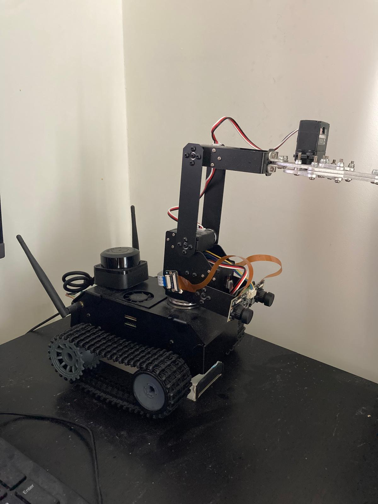
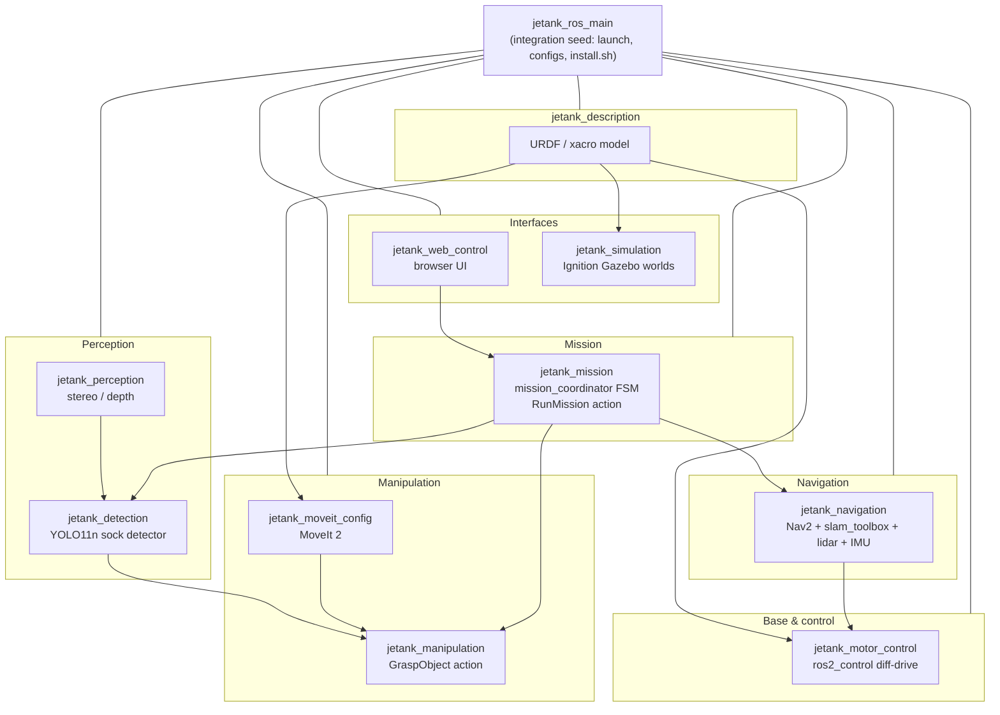

<div align="center">

# 🐾 JeTank ROS 2

### An autonomous tracked robot with an arm, stereo vision, SLAM navigation, and a browser controller — built on ROS 2 Humble for the NVIDIA Jetson Orin Nano Super.




<br/>

[](https://docs.ros.org/en/humble/)
[](https://www.nvidia.com/en-us/autonomous-machines/embedded-systems/jetson-orin/)
[](https://gazebosim.org/docs/fortress/)
[](https://prefix.dev/)
[](#)
[](#)
[](LICENSE)

*A Waveshare JeTank AI Kit, fully re-platformed onto ROS 2 — base, arm, perception, navigation and manipulation, runnable in Gazebo or on real hardware.*

</div>

---

## 🎯 Project goal

**Build a working robot by standing on the shoulders of proven, existing software — then make every part swappable.**

- **Reuse first.** Lean on mature, battle-tested stacks — **Nav2** for navigation, **MoveIt 2** for arm planning, **`ros2_control`** for hardware, **slam_toolbox** for mapping, **Gazebo** for simulation — instead of reinventing them. Get a capable robot running fast.
- **Modular by design.** Each capability is an independent ROS 2 package with clean topic/action/TF interfaces. Swap any module for your own implementation without touching the rest — replace the Nav2 stack with a custom planner, the YOLO detector with your own model, or the motor driver with different hardware, as long as the interface contract holds.
- **Learn by replacing.** The off-the-shelf module is both the baseline *and* the reference spec. Once it works end-to-end, rip out one piece and build it yourself — the surrounding system keeps the bar honest.

> Result: a robot that works **today** on existing software, and a clean seam to grow your own components into **tomorrow**.

---

## ✨ Highlights

- 🧩 **10-package modular workspace** — base, description, perception, navigation, manipulation, detection, simulation, web control, a fetch-sock mission layer, and an integration seed package.
- 🧦 **End-to-end fetch-sock mission** — click a point on the web map and the robot drives there, finds a sock, picks it up, carries it to a deposit zone and drops it (`NAVIGATE_TO_SITE → SEARCH → PICK → NAVIGATE_TO_DEPOSIT → DEPOSIT`). Works end-to-end in sim.
- 🚀 **One-clone bootstrap** — clone the seed repo, run `install.sh`, and the whole multi-repo workspace + environment is provisioned for you.
- 🖥️ **No system ROS 2 required** — the entire stack ships inside a [pixi](https://prefix.dev/) / [RoboStack](https://robostack.github.io/) conda environment. Works on `aarch64` (robot) and `x86_64` (dev laptop).
- 🕹️ **One-command simulation** — `sim_demo.launch.py` boots Gazebo + RViz + SLAM + arm + web UI + sock detection attached to a single sim (turn pieces off per-argument).
- 🗺️ **SLAM + Nav2** — `slam_toolbox` builds a map from the lidar; Nav2 plans and drives autonomously.
- 🦾 **MoveIt 2 arm** — 4-DOF arm with motion planning and an open-loop preset-grasp action server.
- 👀 **Stereo perception** — IMX219-83 stereo camera with GPU/SGBM disparity and a YOLO11n sock detector (lifecycle action server).
- 📱 **Browser remote control** — MJPEG video + WebSocket joystick/keyboard/gamepad, served straight off the Jetson, no client install.
- 🎯 **One-command mission stack** — `jetank_mission web_mission.launch.py` boots the whole fetch loop (nav + perception + grasp + web UI) attached to one sim, driven from the browser.

---

## 🤖 The robot

| | |
|---|---|
| **Base** | Tracked differential drive (PCA9685 + DC motors), `track_width = 0.11 m` |
| **Arm** | 4-DOF arm + gripper, driven via MoveIt 2 |
| **Sensors** | IMX219-83 **stereo** camera, RPLidar, IMU |
| **Compute** | NVIDIA Jetson Orin Nano Super (`linux-aarch64`) |
| **Upgrades over stock** | Stereo camera (depth) replaces the mono IMX219-160; Orin Nano Super replaces the Jetson Nano B01 |

> **Note:** the IMU is bolted to the camera, which rides the arm — so IMU orientation is only valid for fusion when the arm is parked. This matches the hardware and is intentional. See `jetank_description/README.md`.

---

## 🏗️ Architecture



| Package | Build | Role |
|---|---|---|
| [`jetank_ros_main`](https://github.com/kvgork/jetank_ros_main) | ament_python | **Seed / integration** — top-level launch files, RViz configs, `motor_params.yaml`, `install.sh` + bootstrap template |
| [`jetank_description`](https://github.com/kvgork/jetank_description) | ament_cmake | URDF / xacro robot model (primitive geometry, no meshes) |
| [`jetank_motor_control`](https://github.com/kvgork/jetank_motor_control) | ament_cmake | `ros2_control` hardware interface + diff-drive driver (libgpiod / PCA9685) |
| [`jetank_perception`](https://github.com/kvgork/jetank_perception) | ament_cmake | Stereo / mono camera nodes, GPU + SGBM disparity (strategy pattern) |
| [`jetank_detection`](https://github.com/kvgork/jetank_detection) | ament_cmake | YOLO11n single-class sock detector, `DetectSocks` lifecycle action |
| [`jetank_navigation`](https://github.com/kvgork/jetank_navigation) | ament_cmake | Nav2 + slam_toolbox + RPLidar + IMU bringup |
| [`jetank_moveit_config`](https://github.com/kvgork/jetank_moveit_config) | ament_cmake | MoveIt 2 motion-planning config for the arm |
| [`jetank_manipulation`](https://github.com/kvgork/jetank_manipulation) | ament_cmake | Open-loop preset `GraspObject` action server |
| [`jetank_simulation`](https://github.com/kvgork/jetank_simulation) | ament_cmake | Ignition Gazebo Fortress (ros-gz) worlds + launch |
| [`jetank_web_control`](https://github.com/kvgork/jetank_web_control) | ament_python | Browser remote-control node (MJPEG + WebSocket) |
| [`jetank_mission`](https://github.com/kvgork/jetank_mission) | ament_cmake | Fetch-sock mission layer — `mission_coordinator` FSM, `RunMission` action, `web_mission.launch.py` one-command stack |

---

## 🚀 Quickstart — one clone, one script

`jetank_ros_main` is the **seed package**. Clone it, run `install.sh`, and the whole nine-package workspace is fetched and provisioned — no manual cloning of siblings, no manual ROS 2 or pixi setup.

```bash
mkdir -p ~/jetank_ws/src && cd ~/jetank_ws/src
git clone git@github.com:kvgork/jetank_ros_main.git
cd jetank_ros_main
./install.sh                # --https if you have no SSH keys, --build to also compile
```

`install.sh` stages the workspace-root template (`pixi.toml`, `pixi.lock`, scripts), `vcs import`s the sibling repos from `jetank.repos` (pinned to `main`), and installs pixi if it is missing. Run `./install.sh --help` for all flags.

Then build and run — **everything goes through `pixi run`** (there is no system ROS 2):

```bash
cd ~/jetank_ws
pixi run build              # colcon build --symlink-install (all packages)
pixi shell                  # drop into the env (auto-sources the colcon overlay)
```

> Requires **pixi ≥ 0.69** — older pixi cannot read the `pixi.lock` v7 format and will silently regenerate it. `pixi self-update` if versions drift.

---

## 🕹️ Run it in simulation

No hardware needed. One command brings up Gazebo + RViz + SLAM:

```bash
ros2 launch jetank_ros_main sim_demo.launch.py
```

| Arg | Default | Effect |
|---|---|---|
| `world` | `sock_arena` | `empty` · `simple_test` · `obstacle_course` · `sock_arena` · `house` |
| `slam` | `true` | `slam_toolbox` builds `/map` from the sim lidar |
| `rviz` | `true` | loads `rviz/unified.rviz` |
| `arm` | `true` | MoveIt `move_group` + `arm_controller` + grasp server, attached to **this** sim |
| `web` | `true` | web control on `:8080` (with a Twist→TwistStamped bridge) |
| `detect` | `true` | sock detector against the sim left camera, auto-configured + activated |
| `model_path_sim` | `~/models/sock_sim.pt` | trained sim model (`.pt`/`.engine`) for the sock detector |

```bash
# Lighter bringup: just base + lidar + SLAM + RViz (no arm / web / detection)
ros2 launch jetank_ros_main sim_demo.launch.py arm:=false web:=false detect:=false
```

**Drive the base** — the controller takes **`TwistStamped`**:

```bash
ros2 run teleop_twist_keyboard teleop_twist_keyboard \
  --ros-args -p stamped:=true -r /cmd_vel:=/diff_drive_controller/cmd_vel
```

### Worlds

| World | Contents | Use |
|---|---|---|
| `simple_test` | box + cylinder | quick lidar / depth check |
| `obstacle_course` | 5×5 m arena, walls + cylinders | lidar / Nav / SLAM |
| `sock_arena` | room + furniture + socks | detection / manipulation *(default)* |
| `house` | 3-room house + doorways + furniture | SLAM + Nav2 |

### 🧦 Fetch-sock mission

The full autonomous loop — **navigate → search → pick → carry → deposit** — comes up in one command from the `jetank_mission` package and is driven entirely from the browser:

```bash
ros2 launch jetank_mission web_mission.launch.py \
  map:=$HOME/maps/sock_arena.yaml gui:=true use_rviz:=true
```

Then open **http://localhost:8080**, set a deposit area once (deposit mode → click the map), switch to *Fetch sock* mode and click the pick site. The `mission_coordinator` runs a five-state FSM:

```
NAVIGATE_TO_SITE → SEARCH → PICK → NAVIGATE_TO_DEPOSIT → DEPOSIT
```

SEARCH rotates in place watching the YOLO detector; PICK delegates to the `mobile_grasp_coordinator` (3D-segment → base approach → MoveIt preset grasp). The live status line cycles the FSM state through to `DONE`.

| Arg | Default | Effect |
|---|---|---|
| `map` | `~/maps/sock_arena.yaml` | Nav2 map yaml (AMCL + map_server) |
| `world` | `sock_arena` | Gazebo world |
| `model_path_sim` | `~/models/sock_sim.pt` | YOLO sim model |
| `gui` | `false` | Gazebo GUI client (false ⇒ server-only) |
| `use_rviz` | `false` | MoveIt RViz (Nav2's RViz stays off to avoid a 2nd window) |

> Headless by default (browser-driven). The stack composes `mobile_grasp.launch.py` + Nav2 (`mode:=nav2 use_sim_time:=true`) + `mission_coordinator` + web control, staggered with timers (~60 s to fully come up). See **[`jetank_mission/docs/fetch-sock-mission.md`](https://github.com/kvgork/jetank_mission/blob/main/docs/fetch-sock-mission.md)** for the full architecture.

The pick stack alone (no Nav2 / mission, for driving a grasp interactively) is `mobile_grasp.launch.py` — it starts Gazebo + `move_group` + perception + the grasp pipeline and passes `start_arm_active:=true` so MoveIt's trajectories aren't rejected:

```bash
ros2 launch jetank_ros_main mobile_grasp.launch.py gui:=true use_rviz:=true
ros2 service call /mobile_grasp_coordinator/execute_sock_grasp std_srvs/srv/Trigger
```

> `gazebo_sim.launch.py` and `mobile_grasp.launch.py` both take `gui:=true|false` (Gazebo GUI vs server-only) and `start_arm_active:=true|false` (bring the `arm_controller` up active so MoveIt can drive the arm — needed whenever `move_group` runs).

---

## 🦿 Run it on the robot

```bash
pixi run slam                       # SLAM mapping
pixi run nav2 -- map:=<path>        # autonomous navigation against a saved map
pixi run stereo-camera              # stereo perception pipeline
pixi run urdf                       # robot model in RViz
```

| Subsystem | Launch |
|---|---|
| Full bringup | `ros2 launch jetank_ros_main unified.launch.py` (`main.launch.py` is a thin wrapper that disables the web UI) |
| Navigation (SLAM/Nav2) | `ros2 launch jetank_navigation navigation_full.launch.py mode:=slam` |
| Arm (MoveIt 2) | `ros2 launch jetank_moveit_config moveit_bringup.launch.py` |
| Grasp action | `ros2 launch jetank_manipulation grasp.launch.py` |
| Sock detection | `ros2 launch jetank_detection ...` (`DetectSocks` action) |
| Fetch-sock mission | `ros2 launch jetank_mission web_mission.launch.py map:=<path>` (`RunMission` action) |
| Web control | served on `:8080` — open it from any device on the LAN |

---

## 🛠️ Tech & skills demonstrated

`ROS 2 Humble` · `C++17` · `Python` · `ros2_control` · `Nav2` · `slam_toolbox` ·
`MoveIt 2` · `Ignition Gazebo Fortress (ros-gz)` · `OpenCV` (GPU stereo) · `YOLO11n` ·
`URDF / xacro` · `pixi / RoboStack` · `libgpiod` · `WebSocket / MJPEG` ·
`NVIDIA Jetson` embedded integration

---

## 🗺️ Status & roadmap

- [x] Multi-package ROS 2 workspace + one-clone bootstrap
- [x] URDF model, RViz, full Gazebo simulation
- [x] Diff-drive base via `ros2_control`
- [x] Stereo perception (GPU / SGBM disparity)
- [x] SLAM (`slam_toolbox`) + Nav2 in sim
- [x] MoveIt 2 arm config + preset grasp action
- [x] YOLO11n sock detector (PyTorch stage)
- [x] Browser remote control (video + joystick)
- [x] End-to-end fetch-sock mission in sim (web map-click → nav → search → pick → deposit)
- [ ] TensorRT-accelerated detection on Jetson
- [ ] Closed-loop stereo-guided grasping
- [ ] End-to-end autonomous sock collection on real hardware

*This is an active, evolving project — expect things to move.*

---

## 📡 ROS 2 API

Each package documents its own ROS 2 interface (nodes, topics, actions, services, parameters) in its README:

| Package | API doc |
|---|---|
| `jetank_motor_control` | [README](https://github.com/kvgork/jetank_motor_control#ros-2-api) — `robot_controller` node, `/cmd_vel`, diff-drive/arm/gripper controllers |
| `jetank_perception` | [README](https://github.com/kvgork/jetank_perception#ros-2-api) — `stereo_camera_node` / `camera_node`, image/disparity/`points` topics, calibration services |
| `jetank_detection` | [README](https://github.com/kvgork/jetank_detection#topics) — `sock_detector` lifecycle node, `DetectSocks` action, `/detections/socks` |
| `jetank_navigation` | [README](https://github.com/kvgork/jetank_navigation#ros-2-api) — `icm20948_imu` node + Nav2 / slam_toolbox / RPLidar launch wiring |
| `jetank_moveit_config` | [README](https://github.com/kvgork/jetank_moveit_config#ros-2-api) — `move_group`, `follow_joint_trajectory` / `gripper_cmd` actions |
| `jetank_manipulation` | [README](https://github.com/kvgork/jetank_manipulation#ros-2-api) — `grasp_server`, `GraspObject` action |
| `jetank_simulation` | [README](https://github.com/kvgork/jetank_simulation#ros-2-api) — `ros_gz_bridge` topics, controllers, worlds |
| `jetank_web_control` | [README](https://github.com/kvgork/jetank_web_control#ros-2-api) — `web_control_node` / `cmd_vel_bridge`, `NavigateToPose` + `GraspObject` + `RunMission` clients |
| `jetank_mission` | [README](https://github.com/kvgork/jetank_mission#ros-2-api) — `mission_coordinator` FSM, `RunMission` action, `web_mission.launch.py` |
| `jetank_description` | [README](https://github.com/kvgork/jetank_description#ros-2-api) — URDF/xacro model + in-model sensor topics (no runtime nodes) |

This seed package itself ships no runtime nodes (the sim-only `gripper_mimic_relay` lives in `jetank_simulation`) — only two run-and-exit diagnostic scripts: `test_drive` (drives a base test sequence, reads `/odom`) and `test_cameras` (validates the stereo image/`camera_info` topics). This package defines no `msg`/`srv`/`action` of its own — the robot's runtime interfaces live in the sibling packages above.

**Topic contract** — [`config/topics.yaml`](config/topics.yaml) is the single source of truth for the topic names that cross package boundaries (left camera raw + compressed streams, `/detections/socks` + its debug image). The launch files here read it through the `jetank_ros_main.topics` helper module and pass the names explicitly to the `sock_detector` and `web_control_node` includes (via their declared launch args, plus scoped `SetParameter` for the detection topics those launch files don't forward), so a cross-package topic rename is a one-file edit. The consumer nodes in `jetank_detection`/`jetank_web_control` keep the same values as parameter defaults for standalone use, and the file doubles as a standard ROS 2 params file (e.g. `--params-file` for `capture_frames`).

---

## 🧪 Tests

```bash
# pytest directly (fast, no ROS context needed):
pixi run -- bash -c 'cd src/jetank_ros_main && python -m pytest test/ -q'

# or via colcon (same tests, collected through ament):
colcon test --packages-select jetank_ros_main
colcon test-result --verbose
```

> `setup.py` declares pytest via `extras_require={'test': ['pytest']}` (not the legacy `tests_require`, which modern setuptools silently drops and made colcon report `NO TESTS RAN`).

| Test file | Imports | Asserts |
|---|---|---|
| `test/test_flake8.py` | `ament_flake8` | flake8 (PEP 8) is clean across the package. |
| `test/test_pep257.py` | `ament_pep257` | Docstrings follow PEP 257. |
| `test/test_copyright.py` | `ament_copyright` | Copyright headers present — **skipped** (no headers placed yet). |

## 📝 License

[MIT](LICENSE) © 2026 Koen van Gorkom

## 🙏 Acknowledgments

- [Waveshare](https://github.com/waveshare/JETANK) for the open-source JeTank AI Kit
- The ROS 2, Nav2, MoveIt 2 and RoboStack communities
- NVIDIA for the Jetson platform
