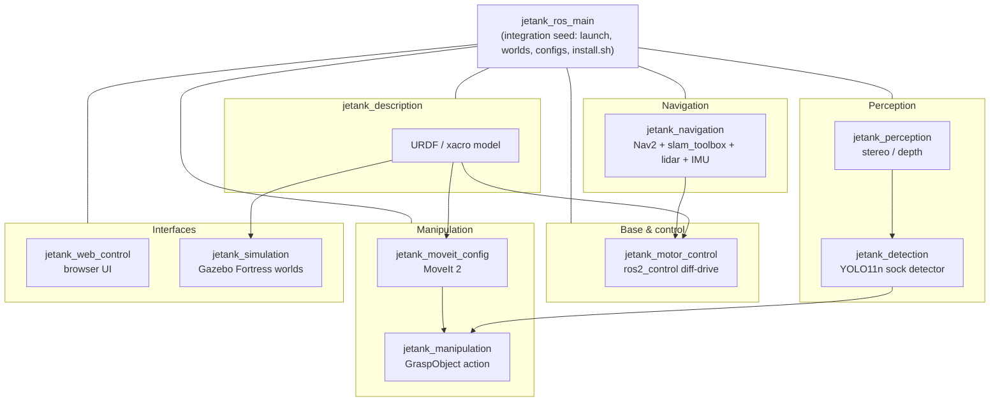

<div align="center">

# 🐾 JeTank ROS 2

### An autonomous tracked robot with an arm, stereo vision, SLAM navigation, and a browser controller — built on ROS 2 Humble for the NVIDIA Jetson Orin Nano Super.


<br/>

[](https://docs.ros.org/en/humble/)
[](https://www.nvidia.com/en-us/autonomous-machines/embedded-systems/jetson-orin/)
[](https://gazebosim.org/)
[](https://prefix.dev/)
[](#)
[](#)
[](LICENSE)

*A Waveshare JeTank AI Kit, fully re-platformed onto ROS 2 — base, arm, perception, navigation and manipulation, runnable in Gazebo or on real hardware.*

</div>

---

## ✨ Highlights

- 🧩 **9-package modular workspace** — base, description, perception, navigation, manipulation, detection, simulation, web control, and an integration seed package.
- 🚀 **One-clone bootstrap** — clone the seed repo, run `install.sh`, and the whole multi-repo workspace + environment is provisioned for you.
- 🖥️ **No system ROS 2 required** — the entire stack ships inside a [pixi](https://prefix.dev/) / [RoboStack](https://robostack.github.io/) conda environment. Works on `aarch64` (robot) and `x86_64` (dev laptop).
- 🕹️ **One-command simulation** — `sim_demo.launch.py` boots Gazebo + RViz + SLAM (and optionally the arm + web UI) attached to a single sim.
- 🗺️ **SLAM + Nav2** — `slam_toolbox` builds a map from the lidar; Nav2 plans and drives autonomously.
- 🦾 **MoveIt 2 arm** — 4-DOF arm with motion planning and an open-loop preset-grasp action server.
- 👀 **Stereo perception** — IMX219-83 stereo camera with GPU/SGBM disparity and a YOLO11n sock detector (lifecycle action server).
- 📱 **Browser remote control** — MJPEG video + WebSocket joystick/keyboard/gamepad, served straight off the Jetson, no client install.

---

## 🤖 The robot

| | |
|---|---|
| **Base** | Tracked differential drive (PCA9685 + DC motors), `track_width = 0.11 m` |
| **Arm** | 4-DOF arm + gripper, driven via MoveIt 2 |
| **Sensors** | IMX219-83 **stereo** camera, RPLidar, IMU |
| **Compute** | NVIDIA Jetson Orin Nano Super (`linux-aarch64`) |
| **Upgrades over stock** | Stereo camera (depth) replaces the mono IMX219-160; Orin Nano Super replaces the Jetson Nano B01 |

> **Note:** the IMU is bolted to the camera, which rides the arm — so IMU orientation is only valid for fusion when the arm is parked. This matches the hardware and is intentional. See `jetank_description/README.md`.

---

## 🏗️ Architecture



| Package | Build | Role |
|---|---|---|
| [`jetank_ros_main`](https://github.com/kvgork/jetank_ros_main) | ament_python | **Seed / integration** — top-level launch files, Gazebo worlds, RViz configs, `motor_params.yaml`, `install.sh` + bootstrap template |
| [`jetank_description`](https://github.com/kvgork/jetank_description) | ament_cmake | URDF / xacro robot model (primitive geometry, no meshes) |
| [`jetank_motor_control`](https://github.com/kvgork/jetank_motor_control) | ament_cmake | `ros2_control` hardware interface + diff-drive driver (libgpiod / PCA9685) |
| [`jetank_perception`](https://github.com/kvgork/jetank_perception) | ament_cmake | Stereo / mono camera nodes, GPU + SGBM disparity (strategy pattern) |
| [`jetank_detection`](https://github.com/kvgork/jetank_detection) | ament_cmake | YOLO11n single-class sock detector, `DetectSocks` lifecycle action |
| [`jetank_navigation`](https://github.com/kvgork/jetank_navigation) | ament_cmake | Nav2 + slam_toolbox + RPLidar + IMU bringup |
| [`jetank_moveit_config`](https://github.com/kvgork/jetank_moveit_config) | ament_cmake | MoveIt 2 motion-planning config for the arm |
| [`jetank_manipulation`](https://github.com/kvgork/jetank_manipulation) | ament_cmake | Open-loop preset `GraspObject` action server |
| [`jetank_simulation`](https://github.com/kvgork/jetank_simulation) | ament_cmake | Gazebo Fortress (ros-gz) worlds + launch |
| [`jetank_web_control`](https://github.com/kvgork/jetank_web_control) | ament_python | Browser remote-control node (MJPEG + WebSocket) |

---

## 🚀 Quickstart — one clone, one script

`jetank_ros_main` is the **seed package**. Clone it, run `install.sh`, and the whole nine-package workspace is fetched and provisioned — no manual cloning of siblings, no manual ROS 2 or pixi setup.

```bash
mkdir -p ~/jetank_ws/src && cd ~/jetank_ws/src
git clone git@github.com:kvgork/jetank_ros_main.git
cd jetank_ros_main
./install.sh                # --https if you have no SSH keys, --build to also compile
```

`install.sh` stages the workspace-root template (`pixi.toml`, `pixi.lock`, scripts), `vcs import`s the sibling repos from `jetank.repos` (pinned to `main`), and installs pixi if it is missing. Run `./install.sh --help` for all flags.

Then build and run — **everything goes through `pixi run`** (there is no system ROS 2):

```bash
cd ~/jetank_ws
pixi run build              # colcon build --symlink-install (all packages)
pixi shell                  # drop into the env (auto-sources the colcon overlay)
```

> Requires **pixi ≥ 0.69** — older pixi cannot read the `pixi.lock` v7 format and will silently regenerate it. `pixi self-update` if versions drift.

---

## 🕹️ Run it in simulation

No hardware needed. One command brings up Gazebo + RViz + SLAM:

```bash
ros2 launch jetank_ros_main sim_demo.launch.py
```

| Arg | Default | Effect |
|---|---|---|
| `world` | `house` | `empty` · `simple_test` · `obstacle_course` · `sock_arena` · `house` |
| `slam` | `true` | `slam_toolbox` builds `/map` from the sim lidar |
| `rviz` | `true` | loads `rviz/unified.rviz` |
| `arm` | `false` | also starts MoveIt `move_group` + `arm_controller`, attached to **this** sim |
| `web` | `false` | also starts web control on `:8080` (with a Twist→TwistStamped bridge) |

```bash
# Everything in one sim: base + lidar + SLAM + arm + RViz
ros2 launch jetank_ros_main sim_demo.launch.py arm:=true
```

**Drive the base** — the controller takes **`TwistStamped`**:

```bash
ros2 run teleop_twist_keyboard teleop_twist_keyboard \
  --ros-args -p stamped:=true -r /cmd_vel:=/diff_drive_controller/cmd_vel
```

### Worlds

| World | Contents | Use |
|---|---|---|
| `simple_test` | box + cylinder | quick lidar / depth check |
| `obstacle_course` | 5×5 m arena, walls + cylinders | lidar / Nav / SLAM |
| `sock_arena` | room + furniture + socks | detection / manipulation |
| `house` | 3-room house + doorways + furniture | SLAM + Nav2 *(default)* |

---

## 🦿 Run it on the robot

```bash
pixi run slam                       # SLAM mapping
pixi run nav2 -- map:=<path>        # autonomous navigation against a saved map
pixi run stereo-camera              # stereo perception pipeline
pixi run urdf                       # robot model in RViz
```

| Subsystem | Launch |
|---|---|
| Full bringup | `ros2 launch jetank_ros_main main.launch.py` |
| Navigation (SLAM/Nav2) | `ros2 launch jetank_navigation navigation_full.launch.py mode:=slam` |
| Arm (MoveIt 2) | `ros2 launch jetank_moveit_config moveit_bringup.launch.py` |
| Grasp action | `ros2 launch jetank_manipulation grasp.launch.py` |
| Sock detection | `ros2 launch jetank_detection ...` (`DetectSocks` action) |
| Web control | served on `:8080` — open it from any device on the LAN |

---

## 🛠️ Tech & skills demonstrated

`ROS 2 Humble` · `C++17` · `Python` · `ros2_control` · `Nav2` · `slam_toolbox` ·
`MoveIt 2` · `Gazebo Fortress (ros-gz)` · `OpenCV` (GPU stereo) · `YOLO11n` ·
`URDF / xacro` · `pixi / RoboStack` · `libgpiod` · `WebSocket / MJPEG` ·
`NVIDIA Jetson` embedded integration

---

## 🗺️ Status & roadmap

- [x] Multi-package ROS 2 workspace + one-clone bootstrap
- [x] URDF model, RViz, full Gazebo simulation
- [x] Diff-drive base via `ros2_control`
- [x] Stereo perception (GPU / SGBM disparity)
- [x] SLAM (`slam_toolbox`) + Nav2 in sim
- [x] MoveIt 2 arm config + preset grasp action
- [x] YOLO11n sock detector (PyTorch stage)
- [x] Browser remote control (video + joystick)
- [ ] TensorRT-accelerated detection on Jetson
- [ ] Closed-loop stereo-guided grasping
- [ ] End-to-end autonomous sock collection on real hardware

*This is an active, evolving project — expect things to move.*

---

## 📝 License

[MIT](LICENSE) © 2026 Koen van Gorkom

## 🙏 Acknowledgments

- [Waveshare](https://github.com/waveshare/JETANK) for the open-source JeTank AI Kit
- The ROS 2, Nav2, MoveIt 2 and RoboStack communities
- NVIDIA for the Jetson platform
